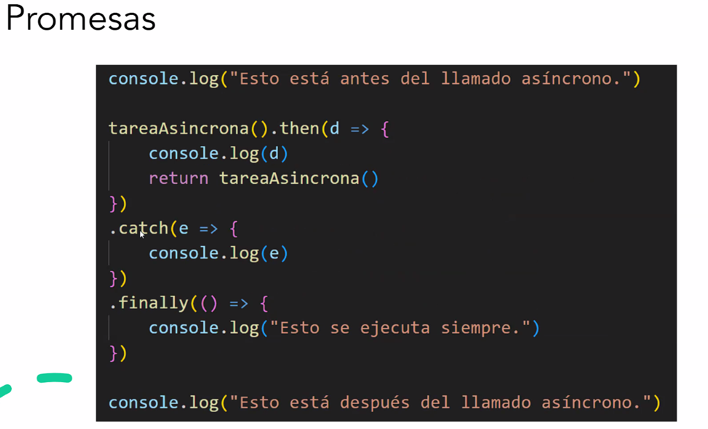
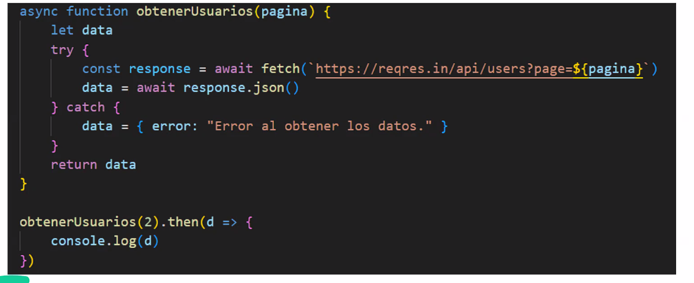

# Sincronismo/Asincronismo, Manejo de Errores y Swagger

## Sincronismo y Asincronismo


Sincronismo:
    - Entrada/salida bloqueante
    - Hilo se bloquea hasta terminar la operacion
    - Multiples hilos necesarios para lograr concurrencia (+Complejidad)

Asincronismo:
    - Entrada/salida no bloqueante
    - "Solo un hilo de ejecucion" para manejar multiples operaciones a la vez
    - Porgramas lineales pueden volverse mas dificiles de representar


Como funciona en JS?

    - Call Stack: Mientras se va ejecutando el programa se ejecutan estan operaciones
    - Task Queue: Algunas funciones mandan una tarea asincronica para ejecutarse, van aca.
    - Callback Queue: Funciones que se ejecuta al momento de terminar una tarea asincronica (se tienen que terminar de ejecutar todas las de call stack) 


_Callbacks_: Funciones que se pasan a tareas **asincronicas** para llamarse al finalizar

_Promesas_: Objetos que representan un "resultado futuro". Se le pueden concatenar operaciones que sucederan cuando se resuelva. Las promesas siguen siendo callbacks, nos sirven para que sea mas elegible a la hora de programar.

    - Resolve: Si la promesa salio bien, se va a resolver la promesa ejecutando el .then
    - Reject: Si la promesa salio mal, se va a "atrapar" en el .catch

=> Etapa de producir la promesa: Resolve | Reject
=> Etapa de resolver la promesa: `.then` | .catch



_Async/Await_: Forma sintacticamente "sincronica" de escribir codigo asincronico. Nos permite antes de ejecutar esperar que la promesa se resuelva.
    - Cada vez que declaro algo del tipo "async" significa que va a devolver una promesa
    - Dentro de una funcion asincronica, si quiero funcionar _sincronicamente_ es que tengo que hacer los awaits 

Nos convierte el codigo asincronico en "codigo sincronico", en el fondo todo funciona como callbacks/promesas. La ventaja de que sea asincronico es que las request no necesitan esperar a la otra, se van atendiendo, y de fondo funciona como si fuera sincronico gracias al async/await. 




---
---

## Manejo de Errores

> Hasta ahora no veniamos manejando muy bien los errores, simplemente devolviamos booleanos o codigos de http. 

- Podemos crear una carpeta de "exceptions" donde creemos nuestros errores y podamos escribir mensajes personalizados. 
- El tratamiento de errores nos hace que si surge algo, no tire todo el servidor y sino manejarlo con try/catch

```javascript
export class ProductNotFoundException extends Error {
    constructor(productId) {
        super()
        this.message = ``Producto con ID ${product.id} no encontrado``
    }
}
```

### Middlewares

> Cuando definimos las rutas, tenemos que indicar que use el productExceptionMiddleware, como lo definimos despues va a ser el "next", es decir el siguiente handler que se va a ejecutar.

=> En vez de trabajarlo en el controller, trabajamos el error en el middleware. La eleccion es por practicidad

```javascript
export function productExceptionMiddleware(error, req, res, next) {

}
```

- Service: Trabajamos errores relacionados mas a nuestro dominio 
- Repositories: Trabajamos errores mas relacionados a la base de datos, +Alto Nivel.


## Swagger

- Forma estandarizada de definir nuestra documentacion sobre los endpoints

- editor.swagger.io

- Se puede incluir swagger a nuestra API => `npm install swagger-ui-express`