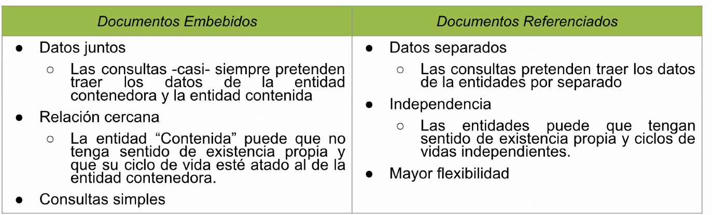

## Persistencia de Datos

Cuando hablamos de persistencia, buscamos que los objetos perduren en el tiempo, es decir que sea no volatil. Para esto, tenemos que recurrir a almacenar el estado de nuestro sistema en un medio como lo pueden ser archivos, bases de datos, etc.

    - Persistencia en Memoria
    - Persistencia en Archivos: Me otorga persistencia pero me puede otorgar problemas de concurrencia, entre otros
    - Persistencia en Base de datos

        Base de datos de Objetos

        Base de datos No-SQL

        Base de datos Relacionales

## Base de datos NoSQL

> Conjunto de bases que no siguen estrictamente el modelo relacional

Terminos:

    Base de datos => Conjunto de colecciones
    Coleccion => Similar a una tabla, sin esquema
    Documento => Similar a una fila, con estructura JSON

## MongoDB

Es la base de datos **documental** mas conocida, tiene un esquema flexible lo que implica que la consistencia de los datos es fundamental mantenerla, porque al ser tan flexible se puede volver un problema esto.

Es escalable horizontalmente, es decir, que puedo agregar mas servidores para poder procesar mejor la informacion y no quede todo centralizado.

> Documentos

Es la unidad basica de almacenamiento, que puede definirse como pares clave-valor similar a un objeto JSON (tecnicamente usa el formato BSON)

    - Flexible: No requiere esquema fijo
    - Anidado: Puede contener otros documentos
    - Autoidentificado: Cada documento tiene un atributo _id que es un ObjectID
    - Autonomo: Contiene toda la informacion

**Documentos embebidos:** No tengo una coleccion aparte para guardar datos especificos, por ejemplo tengo la direccion todo en la misma coleccion:
{
id:
nombre:
direccion: {
calle:
numero:
}
}

**Documentos no embebidos**: Guardo la direccion en otra coleccion, llamada "direcciones"
{
id:
nombre:
direccion: ObjectId("...") // Referencio a la otra coleccion
}

## ODM - Mongoose

ODM (Object Document Mapper) es una herramienta que permite:

    Mapear objetos de js a documentos MongoDB
    Usar interfaz orientada a objetos para interactuar con la base
    Validar, estructurar y manipular los datos mas facilmente

`npm install mongoose --save`
