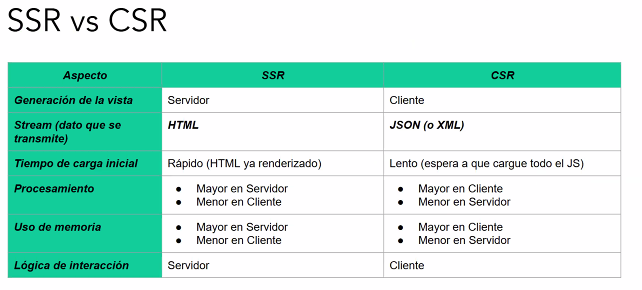
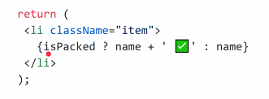
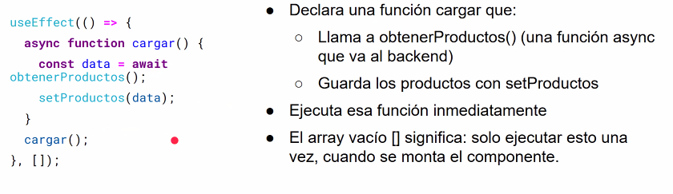
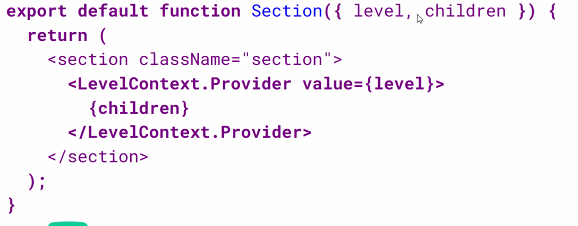

## Cliente liviano (SSR) y Cliente pesado (CSR)



# (🌐) React

> 💭 Repaso DOM: Representacion estructurada de un documento HTML en forma de un arbol jerarquico. En JS permite interactuar con el contenido y la estructura de una pagina web de forma dinamica.

Caracteristicas principales - Componentes: Bloques reutilizables de codigo - Virtual DOM - JSX: Sintaxis que combina Javascript y HTML (Hago una funcion de JS y devuelvo html)

Componente: Pieza que tiene su propia logica y apariencia, que puede ir desde un boton hasta toda la pagina (no recomendable)

## (📠) Virtual DOM

Representacion en memoria de los elementos DOM reales de una pagina, es una copia que mantiene React del DOM real, lo que hace que actualizar los componentes sean mas eficientes.

    1. Cada vez que cambia el estado de la aplicacion, React crea un nuevo arbol que esta actualizado
    2. Se compara el DOM virtual creado con el anterior ==> Reconciliacion
    3.

## Create React App

Forma compatible de crear aplicacion SPA en React, ofrece un setup sin necesidad de configurar.

- Separar todos los componentes se puede hacer como

```jsx
<Header nombre={"Alumno/a de DDSO"}></Header>
```

```javascript
function Header(props) {}

const Header = () => {};
```

- Cada componente mantiene su estado y le podemos pasar propiedades, desde el componente padre al componente hijo.

- Carpetas
  components
  features (distintas paginas que voy a tener: Home, ..)

Idea carrusel: Tener los productos y ir mapeandolos para que se conviertan en un div. Cuando haces un map necesitas una key unica (x ejemplo, productId o un index en el map)

## React Router

React router es una biblioteca que nos permite creas enrutamiento dinamico de forma sencilla - Router: Componente principal encargado del enrutamiento de la app - Link: Componente para crear enlaces (dentro de la app) - Switch: Componente para decidir que mostrar en una ruta - Route: Componente que va a indicar que compoente mostrar segun la URL

```jsx
<Route path = "/products/:title" element={<ProductDetailPage /> } />

// El titulo va a estar cuando cliquea el boton, entonces no es que le pasas el titulo sino que un "contexto"

const ProductDetailPage = () => {

    const {title} = useParams()

    const product = products.find(p =. p.title.toLowerCase() === title.toLowerCase())

    if (!product) {
        return <div>Product not found</div>
    }

    return (
        <>
        ...
        </>
    )
}

// Para definir un link:

<Link to={`/products/${aProduct.title.toLowerCase()}`}><h3>{aProduct.title}</h3></Link>

// Definir componentes que esten siempre en todas las vistas

    <Route path="/" element={<Layout></Layout>}></Route>

// Carpeta Layout

    const Layout = () => {
        <>
            <Header nombre= {"Alumno de DDS"}></Header>
            <NavBar></NavBar>
            <Outlet></Outlet> (Todo lo que viene despues)
        </>
    }

```

### Arbol de renderizado

    - Concepto de componente padre e hijo
    - Arbol de renderizado, constituido por los componentes renderizados
    - Cada componente padre va renderizando a sus componentes hijos

**Renderizado condicional**: Poder o no mostrar componentes HTML segun diferentes condiciones. Se puede renderizar JSX de forma _condicional_ utilizando sintaxis de JS (if, &&, ? : .)


    - &&: Renderiza cuando una condiciones es verdadera, o no renderizar nada en caso contrario

### Hooks

Una funcion de JavaScript que permite usar caracteristicas de React (manejo del estado y el ciclo de vida)

    - Solo se pueden llamar dentro de componentes funcionales
    - Usar en nivel superior de un componente (no dentro de condicionales, bucles ni funciones anidadas)
    - No pueden ser condicionales

Si hay una logica con estado que se utiliza en varios componentes, se puede crear un propio Hook.

#### Hooks - Tipos

    - Estado: Permiten que un componente "recuerde" la informacion, como la entrada del usuario. (useState o useReducer)
    - Efecto: Permite realizar efectos secundarios en los componentes, como obtener datos, actualizar DOM y temporizadores (useEffect)
    - Referencia: Manejar referencias para que un componente contenga
    - Contexto: Para que un componente reciba informacion de componentes principales sin pasarlas como props. (useContext)
    - Performance: Optimizar el renderizando omitiendo el trabajo innecesario (useMemo o useCallback)

🚨 Recordemos que cada componente maneja su propio estado, y si alguien mas lo quiere hacer que sea mandandole una funcion


```jsx
        value={"Hola"}  //El valor viene de lo que haya buscado en la navbar
        onChange={(e) => {setText(e.target.value)}} //Recibe evento y definis que tenes que hacer
```

## Integracion Frontend - Backend

- Las llamadas se podrian implementar en archivos services o api

- Se pueden mockear las requests

  - Archivos .json locales (fetch('/mock/users.json'))
  - Bibliotecas de mock (msw por ejemplo)

- El usuario siempre necesita saber que esta pasando, es decir, cuando este cargando algo usar Spinners, Skeletons, etc.

### Axios

    - Cliente HTTP basado en Promises
    - Hace XMLHttpRequests desde el navegador
    - Hace peticiones HTTP desde node.js
    - Intercepta requests y responses

```jsx
//productosService.js

export async function obtenerProducots() {
  try {
    const response = await axios.get("http://localhost:8000/api/productos");
    return response.data; // Axios ya transforma el json
  } catch (e) {}
}
```

#### Alternativa a pasar props

El contexto permite que el padre provea datos al arbol entero debajo de el, sin utilizar props.

    - Crear un contexto
    - Proveerlo desde el componente que especifica los datos
    - Usar ese contexto desde el componente que necesita esos datos

```jsx
import { createContext } from "react";

export const LevelContext = createContexto({}); //Estado inicial: Puede tener variables de estado o funciones

// Hay que crear un LevelContextoProvider
```



## Custom Hooks

- Nos sirven para un proposito mas especifico de los que ofrece React
- Permiten abstraer logica
- El codigo de los componentes pasa a expresar intencion y no implementacion

Cada llamada a hook es completamente independiente

## CSS in JS

🏴 Un patron donde el CSS se compone usando Javascript en lugar de definirlo en otro archivo .css. No forma parte de React sino que se usa una biblioteca

"emotion/react" una biblioteca para escribir estilos CSS con JavaScript. Se puede usar independiente del framework o con React

"styled-components" componentes que se le inyectan su estilos de forma automatica.
