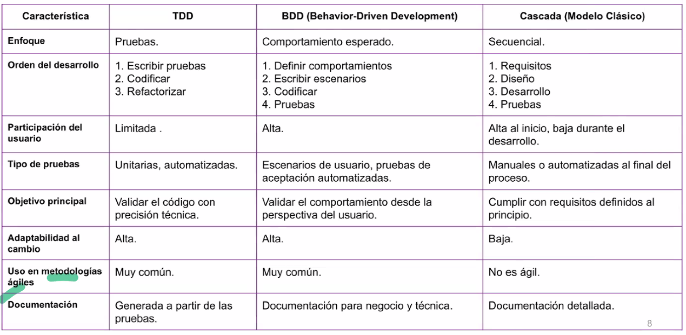

# TDD (Test Driven Development)

> 💭 Metodologia de desarrollo de software en la que primero se crean las pruebas, y en base a eso el codigo. Es el proceso inverso.

<!-- -->

#### (📃) Pasos de la metodologia

    - (1) Prueba que espero que falle, ya que no tengo casi codigo
    - (2) Desarrollar codigo minimo -> KISS
    - (3) Modificar el codigo para optimizarlo

<!-- -->

#### (🚧) Consideraciones

    - Repositorio unico de pruebas
    - Integracion continua
    - Mantener una compatibilidad con el sistema general
    - Constantemente se van a corregir errores chicos

### (📊) Comparacion entre medologias

> [❔] Porque usar TDD?

Se recomienda usar TDD cuando se necesita que la calidad del codigo sea critica, no haya errores, bibliotecas o equipos con cambios constantes, entre otros. En proyectos chicos, cambios rapidos y prototipos no es recomendable usarlo. TDD nos brinda los siguientes beneficios:

    - Calidad en el codigo
    - Mantenibilidad
    - Adaptabilidad al cambio (correccion de errores chicos constantemente)
    - Confianza en el desarrollo (hacemos cambios sin temor a romper algo)
    - Documentacion viva (esta todo en el test)

#### (💫) Mejores Practicas

    - Pruebas pequeñas y aisladas
    - Diseñar los test de manera adecuada, si el test esta mal => el codigo va a estar mal
    - Refactorizacion continua, todo el tiempo se corrigen errores
    - Nomenclatura entendible
    - Capacitacion personal
    - Given-When-Then (Estado inicial - Accion realizada - Verificacion)

#### (🧪) Test Doubles

=> Mocks: Reemplazan funciones y registran su uso, es decir, simular comportamiento de dependencias

=> Stubs: Respuestas predefinidas, con el objetivo de controlar el entorno
